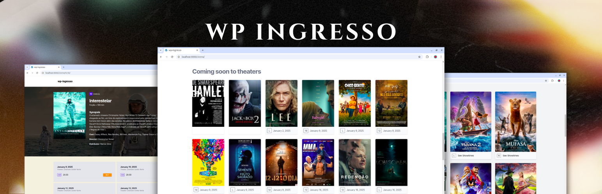

# WP Ingresso

WP Ingresso is a custom WordPress plugin designed to integrate with the Ingresso API, fetching movie data and dynamically displaying it on your WordPress site. 

---

## Installation

The plugin uses the **Ingresso API** to fetch movie information:

### Install via WordPress Dashboard

1. Download the plugin `.zip` file from the plugin repository.
2. Navigate to `Plugins > Add New > Upload Plugin`.
3. Click `Choose File`, select the `.zip` file, and click `Install Now`.
4. After installation, click `Activate` to enable the plugin.
5. Go to `Settings -> Ingresso` and fill the fields accordingly.

### Install via Composer

If you use Composer for managing dependencies:

```bash
composer require wpackagist-plugin/wp-ingresso
```

After that, make sure to activate the plugin from your WordPress dashboard.

---

## Requirements

- **WordPress Version**: ^6.5.2.
- **PHP Version**: 8.1 or higher.

---

## FAQ

1. **How do I customize the frontend output?**
   Copy the files, example `template/template-ingresso-event.php` and paste it into your theme like `my-custom-theme/wp-ingresso/template-ingresso-evento.php` folder, then you can customize the HTML as needed.

2. **Can I use this plugin on multisite installations?**  
   Yes, this plugin is compatible with WordPress multisite.

3. **Does it support caching?**  
   No, caching is not built-in. We suggest to address this topic with your hosting provider.

4. **Can I extend the plugin for more external APIs?**  
   No, the plugin works only with Ingresso.com API client.

---

## License

This plugin is licensed under the **GPL 2.0 or later**.
